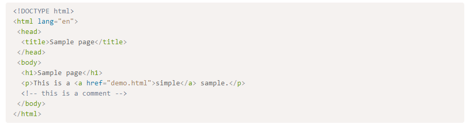
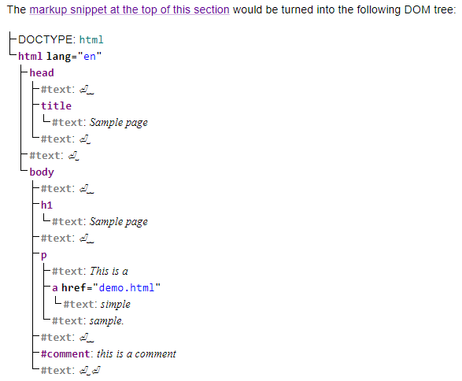
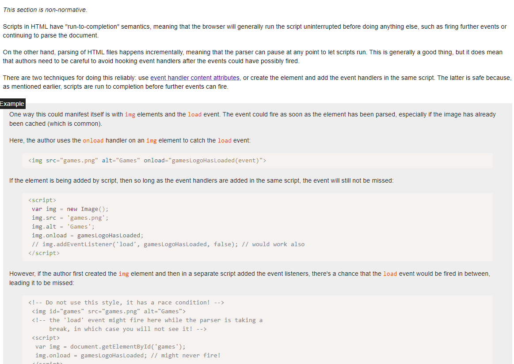
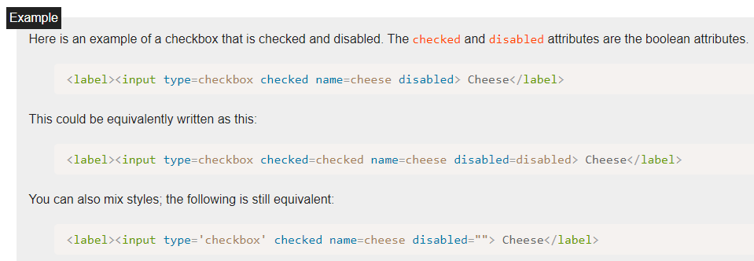
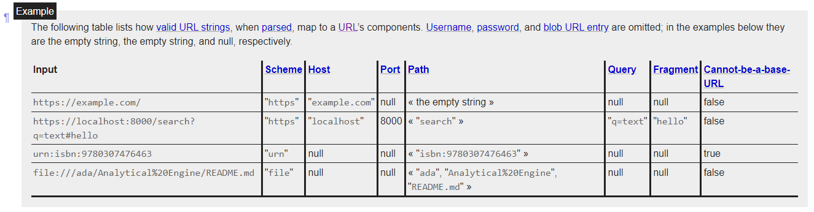
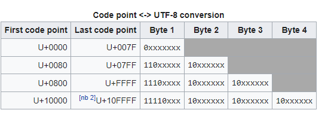

Web Development

> HTML5 for documents. CSS for style format. Javascript for front end behavior. Jave and database are for servor end. http/TCP/IP are for cybersecurity.


- [1. HTML 5 Learning](#1-html-5-learning)
  - [1.1. Introduction](#11-introduction)
  - [1.2. Infrasructure](#12-infrasructure)
  - [1.3. Semantics, structure and API of HTML documents_Chapter 4 to 5](#13-semantics-structure-and-api-of-html-documents_chapter-4-to-5)
    - [1.3.1. Structure](#131-structure)
    - [1.3.2. Content and elements](#132-content-and-elements)
  - [1.4. User interface, script, behavior_Chapter 6 to 8](#14-user-interface-script-behavior_chapter-6-to-8)
  - [1.5. background scipt and server communication_Chapter 9 to 12](#15-background-scipt-and-server-communication_chapter-9-to-12)
- [Javascript Learning](#javascript-learning)
- [CSS](#css)

# 1. HTML 5 Learning

> HTML is short for World Wide Web's core markup language. It is semantic-level markup language to gap the hardware discrepancy.

- Multithreading is not consider. Serilizing the executaion of all script expect the Javascript **sharearrarybuffer**.
- Extensibility. class attribute. script type=" " for or server-side script.
- HTML vs XML. DOM.
- Materials:  [HTML5 Standards](https://html.spec.whatwg.org/#introduction)
- Tools 1: [try syntax online](https://www.w3schools.com/tags/tryit.asp?filename=tryhtml_phrase_strong)
- Tool 2: [COnformance check](https://whatwg.org/validator/)

## 1.1. Introduction

1. This is a simple example:



2. **Tags** have to be nested.

```html
<p>This <em>is <strong>correct</strong>.</em></p>
<!--- em is tag for italic. strong is for bold  p is for paragraph h is for heading--->

```

3. **Elements** and **attribute**

```html
<a href="demo.html">simple</a>
<!--- a is the element. href is the attribute for hyperlink.--->
<input name=address maxlength=200>
<input name=address maxlength='200'>
<input name=address maxlength="200">

```

The attribute value can remain unquoted if it doesn't contain ASCII whitespace or any of " ' ` = < or >. Otherwise, it has to be quoted using either single or double quotes. The value, along with the "=" character, can be omitted altogether if the value is the empty string.

4. DOM(document object model) tree to decribe the html structure.



- head element has a titlle element and text node.

```html
<form name="main">
 Result: <output name="result"></output>
 <script>
  document.forms.main.elements.result.value = 'Hello World';
 </script>
</form>
```

- javascript is used in the script to set form's output to 'Hello World'.

```javascript
var a = document.links[0]; // obtain the first link in the document
a.href = 'sample.html'; // change the destination URL of the link
a.protocol = 'https'; // change just the scheme part of the URL
a.setAttribute('href', 'https://example.com/'); // change the content attribute directly

```

- javascript is a descriptive language, which you basically don't need to think about the memory too much.

```html
<!DOCTYPE html>
<html lang="en">
 <head>
  <title>Sample styled page</title>
  <style>
   body { background: navy; color: yellow; }
  </style>
 </head>
 <body>
  <h1>Sample styled page</h1>
  <p>This page is just a demo.</p>
 </body>
</html>

```

- CSS is for styling! Make it more fancy to look. You can make CSS or javascipt in seperate file or in the same file.

5. [Cybersecurity while HTML SQL Injection](https://www.w3schools.com/sql/sql_injection.asp)

> How to interpret illegal input for servers database?  A piece of string is also a piece of code--> Check each characters one by one.

- Cross-site requrest forgery. HTML forms can be hijacted and send to other orgin.

6. Run to completion pitfall.



## 1.2. Infrasructure

1. Terms Definition

Parallelism
: steps to be run one after another at the same time with the event loop. A parallel queue represents a queue of algorithm **must** be run in series to avoid the **racing** issue.

resources
: library to decodeing the semantics of an external resource.

plugin
: content handlers by the user that can take part in urer agent's redering of a document.

2. Data sturcture

Boolean Attributes
: "true" and "false are not alowed on the boolean attributes". Cannonical name is used. If the attribute is present, its value must either be the empty string or a value that is an ASCII case-insensitive match for the attribute's canonical name, with no leading or trailing whitespace. To represent a false value, the attribute has to be omitted altogether


Numbers- Signed integers Float
: A string is a valid integer if it consists of one or more ASCII digits, optionally prefixed with a U+002D HYPHEN-MINUS character (-). In UTF-8.  U+002D is -. U+002B is +.  1 to 9 is from U+0030 to U+0039. full stop sign is U+002E.

Dates and time

Color
:A string is a valid simple color if it is exactly seven characters long, and the first character is a U+0023 NUMBER SIGN character (#), and the remaining six characters are all ASCII hex digits, with the first two digits representing the red component, the middle two digits representing the green component, and the last two digits representing the blue component, in hexadecimal.

URLs:


Fetch
: MIME type of a resource. MIME sniffing. Extracting character encodings from meta elements. Here is the cybercurity comes.

UTF-8
:a variable-width character encoding used for electronic communication.
.

safe passing of structured data to javascript
: serializable objects and transferable objects. Similar to XML.

## 1.3. Semantics, structure and API of HTML documents_Chapter 4 to 5

### 1.3.1. Structure

```javascript
document.cookie
document.lastModified
document.readyState
document.images
document.links
....
```

### 1.3.2. Content and elements

Metadata content: set up the presentation or behavior of the rest of the contenet: base, link, meta, script,style, template, title.

Flow content:used in the body of the documents: a,h1,h2, img, input, p,q, span, table, time,div,...

sectioninig content: define the scope of heading and footers. nav, section, aside, article.

embedded content: imports another resource to the document. audio, canvas, embed, iframe, img, MathML math

Global attributes: only defined as attributes: dir, autofocus, lang, syle,tittle,translate event handler content.

Microdata: annotate content with specific/customized machine-readable labels. Chapter 5.

> please refer to the chapter 4 for each of this attributes.

## 1.4. User interface, script, behavior_Chapter 6 to 8

## 1.5. background scipt and server communication_Chapter 9 to 12

-----

# Javascript Learning

> Javescript standard [ECMA standard](https://tc39.es/ecma262/#sec-intro)


# CSS 

> CSS is the makeup language for HTML. Standard [W3C](https://www.w3.org/Style/CSS/learning) and [CSS reference](https://www.w3.org/TR/2021/WD-css-ui-4-20210316/)